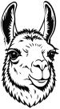

# uyguLama Substack Template



This is a Next.js (App Router) based website template designed to integrate seamlessly with your Substack publication. It automatically fetches and displays your Substack posts while providing a modern, customizable landing page with built-in responsive design.

## Features

- **Substack Integration**: Automatically syncs and displays posts from your Substack newsletter using the Substack API (`src/lib/substack.ts`).
- **Modern UI**: Built with Tailwind CSS and `shadcn/ui` for beautiful, accessible components.
- **Type-Safe**: Developed with TypeScript for robust code quality and easy maintainability.
- **Performance Optimized**: Uses Next.js App Router, optimized Next.js images, and dynamic font loading.
- **Configurable**: Easily update site information, social links, and theme settings via a centralized `src/data/site.json` file.
- **MDX Support**: Create and manage content pages like "About Us" easily using MDX.

## Getting Started

1. Clone this repository.
2. Install dependencies:
   ```bash
   bun install
   ```
3. Open `src/data/site.json` and set your `substackUrl` (e.g., `https://yourpublication.substack.com`), along with your other site details.
4. Run the development server:
   ```bash
   bun dev
   ```

Open [http://localhost:3000](http://localhost:3000) with your browser to see the result.

## Configuration

All site-wide settings (Site name, address, contact info, social media links) are managed in `src/data/site.json`. Just update the values there, and the site will reflect the changes across the header, footer, and contact sections.

## Environment Variables

Copy `env.sample` to `.env` and configure the necessary variables:
- `SUBSTACK_SID`: If your Substack publication requires authentication or if you want to bypass strict rate limits, you can provide your Substack Session ID (SID) cookie value here.

## General Structure

- `src/app`: Contains Next.js App Router pages and layouts, including internationalized routing (`[locale]`).
- `src/components`: UI components organized into `common` (shared pieces), `feature` (domain-specific pieces), and `ui` (shadcn/ui primitives).
- `src/data`: Holds the `site.json` configuration file, which defines site metadata, internationalization, and navigation.
- `src/lib`: Core utility functions, configuration resolvers, and Substack API integrations.
- `src/i18n`: Internationalization dictionaries (`en.json`, `tr.json`, etc.) and configuration logic.
- `src/assets`: Source images for automated asset generation.

## Multi-Language Support (Adding a New Language)

The template supports multiple languages natively. To add a new language:
1. Open `src/data/site.json` and add the new language configuration under `i18n.locales` (e.g., `"fr": { "enabled": true, "label": "Français", "direction": "ltr" }`).
2. Provide the localized values in `src/data/site.json` under `content` (e.g., `siteName.fr`, `navigation.header.fr`).
3. Create a new dictionary file in `src/i18n/dictionaries/` (e.g., `fr.json`) with your translated strings.
4. If you have MDX pages, create the localized versions (e.g., `src/content/about-fr.mdx`).
5. Map any tags and static pages for this locale under `sources.substack.tags.fr` and `sources.substack.pages.about.fr` in `site.json`.

## MDX Support & Contact Form

- **MDX**: You can create fully localized markdown pages (like "About Us") in the `src/content/` directory. Use the `MdxSection` component to embed them within feature pages (like `home.tsx`).
- **Contact Form**: The template includes a built-in Contact Form powered by Web3Forms. It is currently passive. To activate it, simply provide your access key under `shared.web3formsAccessKey` in `site.json` and enable the `<Web3FormsContact>` component in `contact-section.tsx`.

## Substack Tags

To dynamically categorize and filter your Substack posts on the website:
1. Ensure your posts on Substack are tagged.
2. Update `src/data/site.json` under `sources.substack.tags.[locale]` with an array of the tag slugs you want to display (e.g., `["news"]`).
3. You can easily add these tags to your header navigation by updating `content.navigation.header.[locale]` in `site.json` with a link format of `tag:[your-tag-name]`.
4. Posts displayed on the homepage and `/posts` page will automatically filter based on these valid localized tags.

## Image Generation

You can easily generate all necessary site icons and Open Graph images:
1. Place your base SVG images in the `assets/` folder in the project root: `favicon.svg`, `icon.svg` (for icon and apple-icon), and `og-image.svg`.
2. Run the script:
   ```bash
   bun run generate-assets
   ```
3. The script automatically resizes and processes these images into the `public/` directory (`favicon.ico`, `apple-icon.png`, `icon.png`, `opengraph-image.png`). It ensures your logos fit perfectly without being cropped or distorted.

## Technologies Used

- [Next.js](https://nextjs.org/) (App Router)
- [React](https://reactjs.org/)
- [TypeScript](https://www.typescriptlang.org/)
- [Tailwind CSS](https://tailwindcss.com/)
- [shadcn/ui](https://ui.shadcn.com/)
- [Substack](https://substack.com)

## Custom Solutions and Applications

At uyguLama, we are happy to provide the right services tailored to your needs. For your solution requirements, you can get in touch with us via [uygulama.net](https://uygulama.net).
